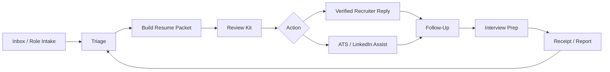

# Inbox To Interview

**Inbox To Interview** is a private, local-first job-search command system that turns inbound roles, recruiter messages, application materials, approvals, follow-ups, and interview prep into one auditable operator workflow.

This repository is a protected public project surface. It is not the full source code, operational system, private workflow, or data room.

## Why It Matters

Job search work is usually scattered across inboxes, resumes, job boards, spreadsheets, memory, and urgency. Inbox To Interview turns that mess into a review-first command center where each action has a receipt, a status, and a safety boundary.

The public story is simple: **public surface, private engine, receipts always.**

## Who It Is For

- Job seekers managing high-volume inbound and outbound opportunities.
- Operators who need private, receipt-backed workflows.
- Builders interested in local-first AI systems with human approval gates.
- Recruiter-facing and ATS workflows where accuracy, privacy, and consent matter.

## How It Works

## Public Surface

This public repository contains:

- Project brief and status.
- Public-safe workflow diagrams.
- Public/private boundary notes.
- Brand visuals and social assets.
- WordPress page draft for FaithCheltenham.com.
- Ownership, security, trademark, and commercial-use terms.
- Launch receipt and checklist.

## Private Engine

The following remain private:

- Source code and private repo history.
- Prompts, agent instructions, and workflow internals.
- Credentials, tokens, mailbox data, and application records.
- Resume source files, private facts, and job-search data.
- Deployment systems, logs, databases, and local infrastructure.

## Current Status

V2 local app implementation is active. The command-center loop, action ledger, receipt model, split runtime scripts, phone surface, and safety gates are represented publicly here while the operating engine remains private.

The hero and banner visuals were generated in Canva for this public surface to better represent the actual project: a private operator room where inbox signals become reviewed actions and receipts.

## Learn More

Project home draft path: `FaithCheltenham.com/projects/inbox-to-interview/`

Ownership and inquiries: [FaithCheltenham.com](https://faithcheltenham.com)

## Ownership

Copyright (c) Faith Cheltenham. All rights reserved.

No license is granted. No source release. No redistribution. No commercial reuse. No model training permission. No implied permission.
