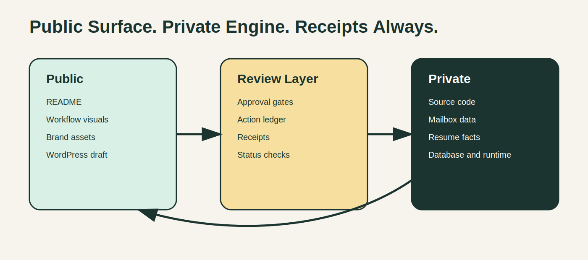

# Workflow Diagrams

## Workflow Overview

Source: `assets/diagrams/workflow-overview.mmd`

Rendered: `assets/diagrams/workflow-overview.svg`

Shows the public-safe command loop from role intake to receipt.

## Public / Private Boundary

Source: `assets/diagrams/public-private-boundary.mmd`

Rendered: `assets/diagrams/public-private-boundary.svg`

Shows what this public repository exposes and what remains private.

