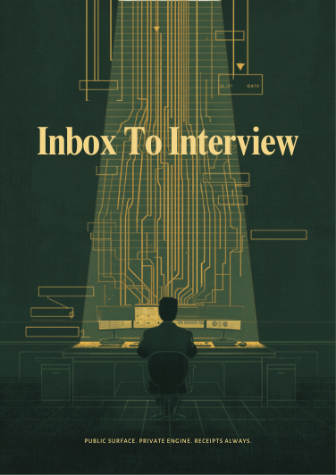
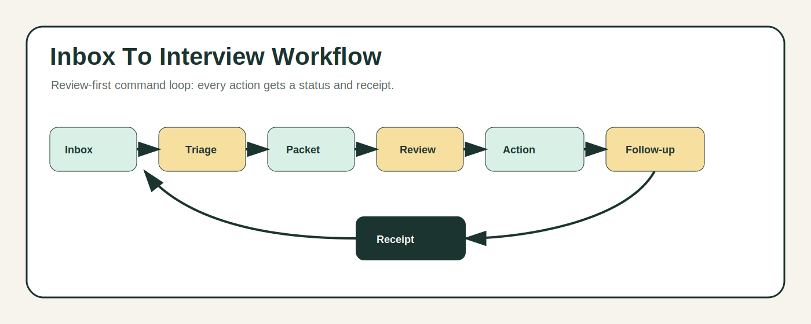

# Inbox To Interview

## What This Project Is

Inbox To Interview is a private, local-first job-search command center that turns role intake, recruiter messages, resume packets, application kits, approvals, follow-ups, and interview prep into one auditable workflow.

It is built around a simple principle:

**Public surface. Private engine. Receipts always.**

## Why It Matters

Job search work often happens across inboxes, memory, job boards, resume drafts, follow-up notes, and pressure. Inbox To Interview brings that work into a calm command loop where each action has a status, a review gate, and a receipt.

## How It Works

The public-safe workflow:

1. Roles and recruiter messages enter the inbox.
2. Opportunities are triaged.
3. Resume packets and application kits are prepared.
4. Faith reviews the next action.
5. Approved recruiter replies or assisted application steps move forward.
6. Follow-ups and interview prep stay visible.
7. Receipts record what happened.

## Project Highlights

- Local-first operator room.
- Review-first action ledger.
- Resume-only public-output defaults.
- Recruiter reply safety gates.
- ATS/LinkedIn assist without silent final submission.
- Phone decision surface.
- Receipts for actions, blockers, approvals, and reports.

## Current Status

V2 public surface package is prepared. The private app engine, source code, prompts, data, credentials, and runtime systems remain protected.

## Visual Gallery

## Public Materials

- Project overview.
- Workflow diagrams.
- Brand visuals.
- Public/private boundary.
- Ownership and use policy.

## Protected Materials

- Source code.
- Prompts and agent instructions.
- Mailbox data.
- Resume sources and private facts.
- Databases, logs, credentials, tokens, and deployment internals.

## Relationship To Faith's Ecosystem

Inbox To Interview sits inside Faith Cheltenham's broader system of private operational tools, public project surfaces, and receipt-backed workflows.

## Ownership Statement

Inbox To Interview is owned by Faith Cheltenham. All rights reserved. No source release, no public license, no redistribution, no commercial reuse, and no model training permission are granted.

## Learn More

Visit [FaithCheltenham.com](https://faithcheltenham.com).
